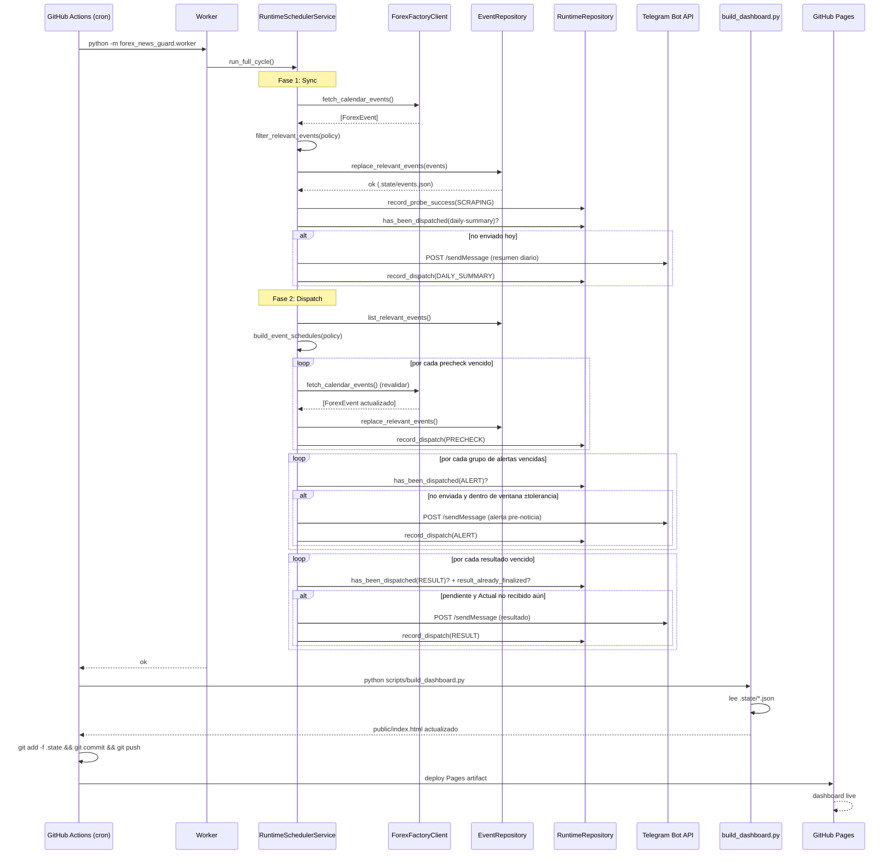

# ARCHITECTURE

## Navegación  
- [[PROJECT]]

## Componentes principales

```
┌─────────────────────────────────────────────────────────────────┐
│                        GitHub Actions                           │
│  cron.yml (*/5 min)  keepalive.yml  telegram-smoke-test.yml     │
│  dashboard-control.yml                                          │
└──────────────────────┬──────────────────────────────────────────┘
                       │ ejecuta
                       ▼
┌─────────────────────────────────────────────────────────────────┐
│                         Worker                                  │
│  Punto de entrada. Instancia RuntimeSchedulerService y llama    │
│  run_full_cycle(). Sin estado propio.                           │
└──────────────────────┬──────────────────────────────────────────┘
                       │ orquesta
                       ▼
┌─────────────────────────────────────────────────────────────────┐
│                  RuntimeSchedulerService                        │
│  Cerebro del sistema. Coordina sincronización, planificación    │
│  de checks y despacho de notificaciones.                        │
│                                                                 │
│  ┌──────────────┐  ┌────────────────┐  ┌──────────────────┐   │
│  │ForexFactory  │  │ EventScheduler │  │TelegramNotifier  │   │
│  │Client        │  │ (planner)      │  │                  │   │
│  └──────────────┘  └────────────────┘  └──────────────────┘   │
│  ┌──────────────┐  ┌────────────────┐  ┌──────────────────┐   │
│  │EventRepo     │  │RuntimeRepo     │  │SettingsService   │   │
│  └──────────────┘  └────────────────┘  └──────────────────┘   │
└─────────────────────────────────────────────────────────────────┘
                       │ escribe
                       ▼
┌─────────────────────────────────────────────────────────────────┐
│                      .state/ (JSON)                             │
│  events.json   runtime.json   settings.json                     │
└──────────────────────┬──────────────────────────────────────────┘
                       │ commiteado por workflow
                       ▼
┌─────────────────────────────────────────────────────────────────┐
│                     GitHub Pages                                │
│  Dashboard estático (HTML + JS) lee .state/ en vivo            │
└─────────────────────────────────────────────────────────────────┘
```

### Worker

Punto de entrada invocado por GitHub Actions (`python -m forex_news_guard.worker`). Sin lógica propia: crea `RuntimeSchedulerService` y delega todo. Puede correr localmente para desarrollo.

### RuntimeSchedulerService

Orquestador central. Ejecuta en dos fases por ciclo:

1. **Fase sync** (`run_cycle_at`): obtiene eventos de Forex Factory, filtra por política, persiste en `EventRepository`, envía resumen diario si corresponde.
2. **Fase dispatch** (`dispatch_due_checks_at`): lee eventos almacenados, calcula schedules, ejecuta prechecks de revalidación, despacha alertas y resultados pendientes hacia Telegram.

Implementa deduplicación completa: ningún mensaje se envía dos veces para el mismo evento+tipo+intento.

### ForexFactoryClient

Integración HTTP con Forex Factory. Usa `cloudscraper` para pasar el WAF Cloudflare que bloquea `requests` normal. Tiene dos estrategias de parsing para el calendario:

1. Extracción del JSON embebido en `window.calendarComponentStates[N]` (preferida, más estable).
2. Fallback a parsing HTML con BeautifulSoup si el JSON embebido no está disponible.

En el JSON embebido, el parser usa primero `date` + `timeLabel`, que es la hora visible en la tabla de Forex Factory. `dateline` queda sólo como fallback porque puede no coincidir con la zona horaria que ve el operador en la UI.

Si recibe 403/429 o detecta challenge de Cloudflare, lanza `ForexFactoryBlockedError` con instrucción de configurar cookie de sesión.

### EventScheduler / AlertPlanner

Lógica pura sin estado ni I/O. Toma lista de `ForexEvent` + `AlertPolicy` y calcula timestamps de `precheck`, `alert` y `result_check` para cada evento. Usado tanto por el worker para dispatch real como por la API para previsualizaciones.

### Storage (capa de persistencia)

Tres repositorios sobre archivos JSON planos en `.state/`:

| Repositorio | Archivo | Qué guarda |
|---|---|---|
| `EventRepository` | `events.json` | Eventos relevantes de hoy y mañana |
| `RuntimeRepository` | `runtime.json` | Historial de dispatches + estado de health probes |
| `SettingsRepository` | `settings.json` | `AlertPolicy` del usuario |

`JsonStateStore` es el adaptador de bajo nivel (leer/escribir JSON con manejo de ausencia de archivo).

### TelegramNotifier / NotificationFormatter

`NotificationFormatter` construye mensajes HTML con emojis, banderas de moneda y semáforos visuales para cada tipo: resumen diario, alerta pre-noticia individual, alerta agrupada, resultado individual, resultado agrupado.

`TelegramNotifier` envía al Bot API de Telegram via HTTP POST. Si el token no está configurado, no envía y registra advertencia.

### API (FastAPI)

Superficie local para desarrollo e introspección. Expone endpoints para consultar eventos relevantes, previsualizas alertas con datos reales o ficticios, leer/escribir `AlertPolicy` y disparar smoke test de Telegram. No interviene en el flujo productivo remoto (GitHub Actions no usa la API).

### Dashboard (GitHub Pages)

Aplicación JS estática servida desde `public/`. Lee `.state/` publicado como parte del repositorio. Muestra: estado de salud del cron, próximas ventanas de riesgo, política activa y ledger de últimos dispatches con scroll interno. Controles interactivos disparan workflows via GitHub API con token de sesión (no persistido).

### Scripts de soporte

| Script | Propósito |
|---|---|
| `build_dashboard.py` | Genera `public/index.html` con estado actual del sistema |
| `apply_dashboard_settings.py` | Escribe `AlertPolicy` en `.state/settings.json` desde parámetros del workflow |
| `send_telegram_smoke_test.py` | Envía 5 mensajes de muestra para validar canal Telegram |

---

## Flujo de datos



---

## Sistemas externos

| Sistema | Rol | Protocolo | Notas |
|---|---|---|---|
| **Forex Factory** | Fuente de calendario económico | HTTPS / HTML | Cloudflare WAF activo; se usa `cloudscraper`. Fallback: cookie de sesión manual via `FOREX_GUARD_FOREX_FACTORY_COOKIE`. |
| **Telegram Bot API** | Canal de notificaciones | HTTPS / REST | Bot token + chat ID configurados como secrets. Soporta chat privado y grupo. Si grupo migra a supergroup, el `chat_id` cambia a formato `-100...`. |
| **GitHub Actions** | Ejecución programada del worker | Cron interno GH | Cron `*/5 * * * *`. No garantiza precisión sub-minuto; el sistema rechaza alertas fuera de ventana ±tolerancia para compensar. |
| **GitHub Pages** | Hosting del dashboard | HTTPS / estático | Público por defecto. Sin autenticación de lectura. Acciones protegidas por token de sesión + environment `ops-control`. |

---

## Dependencias importantes

### Runtime

| Paquete | Propósito |
|---|---|
| `fastapi` + `uvicorn` | API HTTP local |
| `pydantic` + `pydantic-settings` | Modelos de dominio y configuración con validación |
| `cloudscraper` | HTTP compatible con Cloudflare para Forex Factory |
| `beautifulsoup4` | Parsing HTML de calendario y noticias |
| `apscheduler` | BackgroundScheduler para modo continuo local (no usado en producción remota) |
| `httpx` | Cliente HTTP para llamadas a Telegram Bot API |

### Configuración en dos capas

```
Settings (pydantic-settings, FOREX_GUARD_* env vars)
  └── Infraestructura: URLs, paths, tokens, timeouts
      └── Cargada una vez al inicio (lru_cache), no modificable en runtime

AlertPolicy (pydantic, .state/settings.json)
  └── Comportamiento del usuario: impactos, monedas, minutos, timezone
      └── Recargada en cada ciclo del worker (_reload_policy)
```

Los secrets de producción (bot token, chat ID) viven en GitHub Actions Secrets y se inyectan como variables de entorno en el job. Nunca se persisten en `.state/` ni en el dashboard.

---

## Decisiones de diseño relevantes

**Sin base de datos.** Estado en archivos JSON planos. Permite que GitHub Actions comitee el estado directamente al repo y GitHub Pages lo sirva sin infraestructura adicional.

**Worker run_once, no daemon.** En producción el worker corre y termina; GitHub Actions es el scheduler. `BackgroundScheduler` de APScheduler existe en el código pero sólo se usa para modo continuo local de desarrollo.

**Ventana estricta de alertas.** El worker rechaza alertas fuera de `[alert_at - 30s, alert_at + 5min]` para evitar notificaciones tardías cuando GitHub Actions ejecuta con retraso. Mejor silencio que aviso con timing engañoso.

**Resumen diario sin catch-up tardio.** El daily summary sólo se envía entre `00:00` y `00:30` en la timezone activa. Si GitHub Actions no corre en esa ventana, el resumen se omite en vez de enviarse horas tarde.

**Resultados sólo con dato real.** `FOREX RESULT UPDATE` requiere `Actual` real. Si Forex Factory sigue en `N/D` o vacío, no se emite mensaje aunque los retries ya estén vencidos.

**Timezone controlada desde dashboard.** `AlertPolicy.timezone` sigue guardado en `.state/settings.json`; el dashboard lo edita con un selector IANA y el workflow `dashboard-control.yml` lo aplica vía `INPUT_TIMEZONE`.

**Deduplicación por `RuntimeRepository`.** Cada dispatch queda registrado en `runtime.json` con `(event_id, kind, scheduled_for, attempt)`. Antes de enviar cualquier mensaje se consulta este registro. Garantiza idempotencia ante re-ejecuciones del cron.

**Dos estrategias de parsing para Forex Factory.** Primero intenta extraer `window.calendarComponentStates` (JSON embebido, más robusto). Si falla, hace HTML scraping con BeautifulSoup. Esto protege contra cambios de estructura HTML pero no contra cambios en el JSON embebido.
